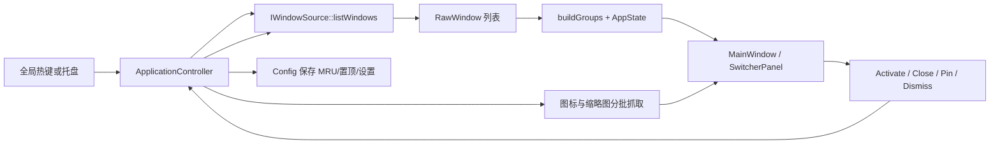

# winSwitch 项目维护与功能演进指南

> 文档定位：当前代码事实基线、接手维护手册和后续功能清单
> 基线日期：2026-08-13
> 代码版本：`0.2.0` + Windows UI 与当前用户安装包基线（以本文件所在提交为准）
> 主要验证环境：Windows 11、Qt 6.8.0、MSVC 2022、CMake 3.27+

## 1. 结论摘要

`winSwitch` 是一个使用 C++17 和 Qt 6 Widgets 实现的桌面窗口切换管理器。当前代码已经完成 v0.2 规划中的搜索、MRU 最近使用排序、多屏定位、热键增强、平台能力诊断、配置导入导出和 Windows 缩略图修复等主要工作。

当前最准确的项目判断是：

- Windows 版已经形成可日常试用的主流程；本轮补齐了深色标题栏、安全尺寸、缩略图不可用占位、空状态、筛选横向滚动、长标签省略、分组数量层级和首批自动化 UI 测试。缩略图兼容性及关闭结果同步仍需持续完善。
- macOS 和 Linux 代码可以提供基础窗口枚举能力，但全局热键、图标、关闭窗口等关键能力没有闭环；当前 CI 也没有验证这两个平台。
- Wayland 受平台安全模型限制，不应承诺与 Windows 相同的跨应用观察和控制能力。
- 仓库已有较多规划文档，但部分“当前状态”仍停留在 v0.2 实现之前。维护时应以本文件、代码和测试结果为准，以旧文档作为历史设计输入。

建议下一阶段先做“Windows 稳定性与可维护性版本”，优先补自动化测试、缩略图降级、关闭结果同步与失败反馈、CI 与文档一致性，再进行大规模视觉改版或跨平台深度扩展。

## 2. 当前功能状态

### 2.1 已实现

| 功能 | 当前实现 | 主要代码 |
|---|---|---|
| 单实例运行 | 使用 `QSharedMemory` 检测重复实例 | `src/app/SingleInstance.*` |
| 系统托盘 | 打开设置、退出；双击托盘显示面板 | `src/app/Application.cpp` |
| Windows 全局热键 | `RegisterHotKey`，默认 ``Alt+` ``，修改后即时重注册并支持失败回滚 | `src/app/HotkeyManager_win.cpp` |
| 窗口枚举 | Win32 `EnumWindows`，过滤不可见、工具窗、DWM cloaked 窗口及自身窗口 | `src/platform/windows/WinWindowSource.cpp` |
| 应用分组 | 按可执行文件完整路径分组，可排除、置顶 | `src/core/WindowModel.cpp` |
| 窗口搜索 | 匹配应用名、窗口标题、文件夹路径，不区分大小写 | `src/core/WindowModel.cpp`、`src/ui/SwitcherPanel.cpp` |
| MRU 排序 | 应用级记录持久化，窗口级记录仅在本次进程中保存；可在设置关闭 | `src/core/Config.cpp`、`src/app/Application.cpp` |
| 窗口激活 | Windows 下恢复最小化窗口并尝试置前 | `src/platform/windows/WinWindowSource.cpp` |
| 关闭窗口/整组 | Windows 下发送 `WM_CLOSE`；整组关闭直接执行，不弹确认框 | `src/platform/windows/WinWindowSource.cpp`、`src/ui/SwitcherPanel.cpp` |
| 图标抓取 | 优先从 exe 获取大图标，再回退窗口类图标 | `src/platform/windows/WinWindowSource.cpp` |
| 缩略图抓取 | `PrintWindow(PW_RENDERFULLCONTENT)`，裁剪 DWM 边框，检测空白/截断并缩放 | `src/platform/windows/WinWindowSource.cpp` |
| Explorer 路径 | 通过 `IShellWindows` 读取资源管理器窗口路径并用于搜索、显示和排序 | `src/platform/windows/WinExplorerPaths.cpp` |
| 键盘导航 | 搜索框输入，方向键选择，Enter 激活，Esc 清空搜索或关闭面板 | `src/ui/SwitcherPanel.cpp` |
| 多屏定位 | 面板显示在鼠标指针所在屏幕中央 | `src/ui/MainWindow.cpp` |
| 设置 | 热键、缩略图、MRU、语言、排除/置顶应用、配置导入导出 | `src/ui/SettingsDialog.cpp` |
| Windows 开机启动 | 默认启用，可在设置中切换；通过当前用户 `HKCU\Software\Microsoft\Windows\CurrentVersion\Run` 注册 | `src/app/StartupManager.cpp`、`src/core/Config.cpp` |
| 平台诊断 | 显示版本、平台、会话、能力等级、配置/日志路径 | `src/platform/PlatformCapabilities.h`、`src/ui/SettingsDialog.cpp` |
| 中英文 | 根据系统或配置选择中文/英文 | `src/core/I18n.*` |
| 日志 | Qt 全局消息处理器追加写入 `app.log` | `src/core/AppLog.cpp` |
| Windows 深色标题栏 | Windows 11 通过 DWM 沉浸式深色属性匹配深色面板，并兼容旧属性号回退 | `src/ui/MainWindow.cpp` |
| 面板安全尺寸 | 根据工作区上限计算面板尺寸并保留边距，避免低分辨率下越界 | `src/ui/UiSizing.*`、`src/ui/MainWindow.cpp` |
| 缩略图降级 | 无缩略图时显示应用图标及“预览不可用”占位文案 | `src/ui/WindowCard.cpp`、`src/core/I18n.*` |
| 空状态/无搜索结果 | 明确展示“没有可切换窗口”或“没有匹配结果”及提示 | `src/ui/SwitcherPanel.cpp`、`src/core/I18n.*` |
| 筛选横向滚动 | 顶部筛选项溢出时可横向滚动；兼容触控板像素增量和非整格滚轮增量，并保留原生水平滚动 | `src/ui/SwitcherPanel.cpp` |
| 长筛选标签 | 过长应用名限制宽度并省略显示，完整名称保留在工具提示中 | `src/ui/SwitcherPanel.cpp` |
| 分组标题层级 | 应用名与窗口数量使用独立标签和不同视觉层级 | `src/ui/SwitcherPanel.cpp`、`resources/styles/app.qss` |
| 自动化测试 | Qt Test 覆盖配置路径策略、安全尺寸、空状态、筛选滚动、整组关闭和主窗口生命周期；PowerShell 回归测试覆盖安装验证所需的注册表缺失场景；当前 CTest 共 5 项 | `tests/test_config_paths.cpp`、`tests/test_ui_sizing.cpp`、`tests/test_switcher_panel.cpp`、`tests/test_main_window_lifecycle.cpp`、`tests/test_installer_verification_helpers.ps1` |
| Qt 本地运行时部署 | Windows Debug/Release 构建后自动用 `windeployqt` 将 Qt DLL 部署到 EXE 输出目录、平台插件部署到其子目录；分发时保留完整部署目录树 | `CMakeLists.txt`、`tests/verify_windows_deployment.ps1` |
| Windows 当前用户安装包 | CPack + Inno Setup 生成无需管理员权限的安装器，包含 Qt/MSVC 运行库、桌面/开始菜单快捷方式、开机启动注册和卸载清理 | `CMakeLists.txt`、`packaging/*`、`tests/verify_windows_installer.ps1` |

### 2.2 部分实现或有明显限制

| 功能 | 限制 |
|---|---|
| Windows 缩略图 | 最小化窗口直接放弃；Chromium、UWP、硬件加速或受保护窗口可能返回空白/不完整内容；截图中的多个窗口因此只显示小图标。诊断页当前标为“完整支持”过于乐观。 |
| 窗口激活 | Windows 的前台激活受系统焦点策略、权限级别和目标进程状态影响，接口没有返回成功/失败结果。 |
| 关闭窗口/整组 | `WM_CLOSE` 是请求而非保证；应用可以拒绝、弹出保存提示或延迟关闭。整组关闭按产品约定直接执行、不要求确认；当前 UI 仍会乐观移除卡片，尚缺真实关闭结果同步和失败反馈。 |
| MRU | 应用 MRU 最多保留 50 条并持久化；窗口 MRU 以 HWND 为键，仅存在内存中，重启丢失。 |
| 多屏 | 仅按鼠标所在屏幕定位；没有“前台窗口所在屏幕/固定屏幕/记忆上次屏幕”策略。 |
| 配置 | `panel_width` 和 `panel_height` 已持久化，但设置页没有编辑入口；读取时缺少类型、范围和枚举值的严格校验。 |
| 单实例 | 第二次启动只弹出“已运行”，不会通知已有实例显示面板。 |
| macOS | 可枚举/抓取部分窗口并激活应用，但热键、关闭、图标不可用，精确窗口激活有限。 |
| Linux X11 | 可枚举、激活、关闭和抓取部分缩略图，但全局热键与图标未实现。 |
| Wayland | 全局窗口枚举、热键、缩略图、激活和关闭通常不可用。 |

### 2.3 未实现或尚不完整的工程能力

- 自动化测试已建立最小基线：当前有 4 个 Qt Test 目标、1 个安装验证 PowerShell 回归测试和 Windows 安装器端到端脚本；仍缺 Config 完整读写、WindowModel、平台层和端到端 UI 自动化覆盖。
- 崩溃报告、日志轮转、诊断信息复制/导出。
- 无障碍语义、完整键盘焦点可视化、高 DPI/缩放矩阵验证。
- 自动更新、正式代码签名和签名证书管理。
- 配置 schema 版本与迁移机制。
- macOS/Linux CI 构建验证；当前 GitHub Actions 只有 `windows-latest`。

## 3. Windows 11 当前界面分析

本节基于 2026-08-09 提供的 1280×654 截图，并结合 `SwitcherPanel`、`WindowCard`、`MainWindow` 和 `app.qss` 分析。

### 3.1 做得较好的部分

- 搜索框位于首要位置，默认获得焦点，符合“唤出后直接输入”的高频流程。
- 顶部应用筛选、应用分组和窗口卡片三层信息结构清楚。
- 深色主题、卡片边界、关闭悬浮按钮和选中状态已有统一样式基础。
- 缩略图分批加载，先显示结构再补纹理，避免一次性处理全部窗口。
- 应用组支持置顶和整组关闭，窗口多时有实际管理价值。

### 3.2 本轮已完成的界面改进

下列项目已在 2026-08-09 的 Windows UI 优化中实现，并由自动化测试或构建检查覆盖：

| 项目 | 已实施行为 | 验证方式 |
|---|---|---|
| 深色标题栏 | Windows 11 使用沉浸式深色标题栏，保留兼容属性号回退 | Debug/Release 构建；代码静态检查 |
| 低分辨率安全尺寸 | 面板宽高受当前屏幕可用区域限制，并保留边距 | `ui_sizing` Qt Test |
| 缩略图不可用占位 | 抓图不可用时显示应用图标与状态文案，避免大面积无意义黑底 | `switcher_panel` Qt Test；代码静态检查 |
| 空状态和无搜索结果 | 内容区分别展示空窗口和无匹配提示 | `switcher_panel` Qt Test |
| 筛选区横向滚动 | 筛选项过多时支持横向滚动，触控板像素增量、非整格纵向滚轮和原生水平滚动均有处理 | `switcher_panel` Qt Test |
| 长筛选标签 | 标签限制最大宽度并省略，工具提示保留完整应用名 | `switcher_panel` Qt Test |
| 分组数量层级 | 应用名与窗口数量拆为 `GroupTitle`、`GroupCount`，分别设定主次样式 | `switcher_panel` Qt Test；代码静态检查 |

### 3.3 仍需完善的界面问题

| 优先级 | 现象 | 原因判断 | 建议 |
|---|---|---|---|
| P0 | 关闭整组后卡片可能与真实窗口状态不一致 | 关闭请求不等待窗口销毁或拒绝结果 | 整组关闭保持直接执行；增加关闭结果同步、失败反馈和延迟重枚举。筛选 chip 的 `×` 可改为菜单或仅悬停显示 |
| P1 | 组操作按钮远离组标题，在宽窗口上关系较弱 | 头部布局把操作推到最右侧 | 将操作收进组标题右侧菜单，或限制内容最大宽度 |
| P1 | 键盘上下移动与卡片实际换行布局不一致 | 模型不知道每行卡片数，`moveSelection` 只按线性窗口序列移动 | UI 根据列数计算二维导航，或使用真正的网格/列表视图模型 |
| P2 | 尚无加载中和操作失败状态 | 空状态、无搜索结果与缩略图不可用已实现，但缺枚举/抓图加载进度及关闭/激活失败提示 | 增加统一的 loading、pending、error 状态页和可操作提示 |
| P2 | 标题截断后只能悬停查看，窗口之间不易区分 | 固定 210px 单行标题 | 搜索结果高亮；允许两行标题；对相同标题增加路径/进程辅助信息 |
| P2 | 控件密度、字号和 Windows 11 原生观感仍偏“工具原型” | QSS 是固定像素样式，缺少设计 token 和 DPI 验证 | 抽出颜色、间距、圆角、字号规范；覆盖 100%/125%/150%/200% 缩放 |

### 3.4 建议的面板状态模型

后续 UI 不应只区分“有卡片/无卡片”，建议统一为：

1. `LoadingWindows`：正在枚举窗口（待实现可见加载状态）。
2. `Ready`：窗口结构已显示，纹理可继续异步更新。
3. `Empty`：没有可切换窗口（已实现）。
4. `NoSearchResult`：搜索没有匹配项，保留清除搜索入口（已实现）。
5. `ThumbnailUnavailable`：单个窗口无法抓图，提供稳定占位（已实现）。
6. `ActionPending/ActionFailed`：关闭或激活请求正在处理/失败（待实现；整组关闭不应增加确认步骤）。

## 4. 架构与运行流程

### 4.1 分层职责

| 层 | 职责 | 维护边界 |
|---|---|---|
| `core` | 配置、i18n、窗口分组/过滤/排序状态 | 应保持与具体平台和 QWidget 解耦，优先放纯逻辑和可单测代码 |
| `platform` | 枚举、激活、关闭、图标/缩略图、平台能力 | 平台差异必须封装在接口后；不要在 UI 中出现 Win32/X11/macOS API |
| `app` | 生命周期、托盘、热键、单实例、跨层编排、纹理缓存 | 负责用例流程，不负责具体控件布局和原生抓图细节 |
| `ui` | 主窗口、切换面板、卡片、设置、消息框 | 通过 `AppState` 和动作信号与应用层交互，不直接调用平台实现 |
| `resources` | QSS 和 Qt 资源注册 | 视觉改动需同时验证不同 DPI、语言和平台 |

### 4.2 唤出与切换数据流



### 4.3 关键数据对象

- `RawWindow`：平台层产生的原始窗口信息，包含窗口 ID、标题、exe、应用名和可选文件夹路径。
- `AppGroup`：按 exe 完整路径聚合的应用组，包含窗口列表与置顶状态。
- `AppState`：面板状态，包含所有组、当前应用筛选、搜索词和选择位置。
- `Config`：JSON 配置对象，同时包含用户设置和应用级 MRU 时间。
- `PlatformCapabilities`：用于诊断页的静态能力描述，目前不能表达运行时失败率和权限状态。
- `PanelAction`：UI 向应用层发送的动作命令。

## 5. 配置、数据和日志

### 5.1 存储位置

程序会先测试 exe 所在目录是否可写：

- 可写：`config.json`、`app.log` 和 `.welcome_shown` 放在 exe 同目录，形成便携模式。
- 不可写：使用 Qt `AppConfigLocation`；Windows 通常位于用户的 AppData 配置目录。

这个自动选择行为需要在用户文档中明确，因为以不同权限或从不同目录运行可能得到不同配置位置。诊断页显示的路径才是当前进程的真实位置。

### 5.2 当前配置字段

| JSON 字段 | 类型/默认值 | 说明 |
|---|---|---|
| `hotkey` | string / ``Alt+` `` | 全局热键 |
| `thumbnail` | bool / `true` | 是否抓取和显示缩略图 |
| `panel_width` | number / `960` | 面板基准宽度；UI 暂无编辑入口 |
| `panel_height` | number / `600` | 面板基准高度；UI 暂无编辑入口 |
| `language` | string / `auto` | `auto`、`zh`、`en` |
| `mru_enabled` | bool / `true` | 是否启用 MRU |
| `pinned` | string[] | 置顶应用的 exe 文件名，小写比较 |
| `excluded` | string[] / `TextInputHost.exe` | 排除应用的 exe 文件名 |
| `mru` | object | 应用 exe 文件名到毫秒时间戳，保存时最多保留 50 条 |

### 5.3 配置维护要求

- 新字段必须有默认值，缺失字段应兼容旧配置。
- 引入 `schema_version` 前不得删除或改变既有字段语义。
- 保存应改为 `QSaveFile` 原子替换，避免崩溃/断电留下半个 JSON。
- 对热键、语言、尺寸、数组长度和 MRU 时间戳做显式校验与范围限制。
- 导入前显示变更摘要；导入后只有点击保存才正式生效，界面文案要讲清这一点。

### 5.4 日志维护要求

当前日志每次写入都打开文件并永久追加。建议增加：

- 单文件大小上限与 2～5 个轮转文件。
- 启动版本、OS、Qt 版本、DPI、屏幕信息和能力检测结果。
- 窗口枚举数量、过滤原因统计、抓图失败原因分类和耗时。
- “复制诊断信息/打包诊断文件”按钮；默认排除窗口标题、完整路径等隐私数据，或先征得用户确认。

## 6. 构建、验证与发布现状

### 6.1 Windows 本地构建

```powershell
cmake -B build -DCMAKE_PREFIX_PATH="C:\Qt\6.8.0\msvc2022_64"
cmake --build build --config Release --parallel
```

Windows 构建会在 `winSwitch` 链接完成后自动调用 Qt 安装目录中的 `windeployqt`。所需 Qt DLL 部署到 `build/<配置>/`（与 EXE 同级），平台插件（包括 `qwindows`）部署到 `build/<配置>/platforms/` 等子目录。分发或移动构建产物时必须保留整个 `build/<配置>/` 部署目录树，不能只复制 `winSwitch.exe`；这样在未安装 Qt 的机器上直接运行时才不会因缺少 Qt DLL 或平台插件立即失败。

部署检查命令：

```powershell
.\tests\verify_windows_deployment.ps1 -ExePath .\build\Release\winSwitch.exe -Configuration Release
```

构建 Windows 安装包需要 Inno Setup 6+：

```powershell
cmake --build build --config Release --target package
```

产物为 `build/winSwitch-<版本>-windows-x64.exe`。安装器默认安装到 `%LOCALAPPDATA%\Programs\winSwitch`，不申请管理员权限；`bin/` 包含程序、Qt 与 MSVC 运行库，`plugins/` 包含 Qt 插件。安装时写入当前用户开机启动项，卸载时仅终止可执行路径与本次安装目录精确匹配的实例，再清理程序文件和启动项。安装版通过 `installed.marker` 将 `config.json`、`app.log` 等可变数据放到 `QStandardPaths::AppConfigLocation`，便携构建仍优先使用可写的 EXE 目录。

安装器端到端检查命令：

```powershell
.\tests\verify_windows_installer.ps1 -InstallerPath .\build\winSwitch-0.2.0-windows-x64.exe
```

该脚本会静默安装到含空格的临时路径，验证 Qt/MSVC 文件、启动注册表值和真实程序启动，再在程序运行时卸载并确认进程、安装目录和启动项被清理。2026-08-13 已在当前工作区通过上述完整流程。

### 6.2 自动化现状

- `CMakeLists.txt` 已启用 CTest，当前有 `config_paths`、`ui_sizing`、`switcher_panel` 与 `main_window_lifecycle` 四个 Qt Test 目标。
- GitHub Actions 当前只在 `windows-latest` 构建，并生成便携 zip 与 Inno Setup 安装器。
- CI 会执行安装器端到端验证；tag `v*` 会创建 GitHub Release，同时上传 Windows zip 和安装器。
- macOS/Linux 当前没有 CI 构建，恢复相应 job 后再扩充分发说明。

### 6.3 最低验证矩阵

| 范围 | 必测项 |
|---|---|
| 构建 | Debug/Release；干净构建；Windows CI |
| 安装包 | 普通用户安装；Qt/MSVC 运行库；含空格路径；开机启动；运行中升级/卸载；启动项和安装目录清理 |
| 配置 | 无配置、旧配置、损坏 JSON、只读目录、导入导出、热键回滚 |
| 窗口 | 普通 Win32、Explorer、Chromium、Electron、UWP/商店应用、管理员窗口、最小化窗口 |
| 面板 | 0/1/大量窗口；长标题；重复标题；搜索无结果；快速重复唤出 |
| 显示 | 单屏/双屏；不同 DPI；负坐标屏幕；任务栏不同位置；1280×720 到 4K |
| 操作 | 激活、单个关闭、整组关闭、拒绝关闭、保存确认框、窗口在操作中消失 |
| 稳定性 | 连续唤出 100 次；窗口快速创建销毁；抓图失败；退出时仍有待处理纹理 |
| 语言 | 中文、英文、系统自动；长文案不截断 |

## 7. 风险与技术债清单

### P0：发布前必须处理

1. **扩展测试基线**
   当前已有安全尺寸和 `SwitcherPanel` 的两项 Qt Test；后续为 `Config`、`buildGroups/AppState`、搜索、置顶、排除、MRU 和导入校验增加测试，并接入 CI。

2. **修正缩略图能力与降级**
   Windows 诊断页应标为“部分支持”；为最小化、抓取失败和不支持的窗口提供可解释占位；记录失败分类，避免把平台限制当崩溃修复。

3. **关闭操作与真实状态同步**
   整组关闭直接执行，不增加确认。发送 `WM_CLOSE` 后重新枚举或等待窗口销毁事件；被拒绝/延迟的窗口不能永久从 UI 假删除，并需要提供失败反馈。

4. **配置可靠写入与校验**
   使用原子写入，约束面板尺寸和语言枚举，处理损坏配置并保留可恢复备份。

5. **统一文档与 CI 事实**
   README 改为当前仅发布 Windows 包；若恢复 macOS/Linux job，再更新支持表和产物说明。

### P1：下一迭代优先

1. 将纹理抓取移出 UI 主线程，支持取消、超时、结果版本校验和安全退出。
2. 解决 HWND 重用与缓存陈旧：缓存键至少关联进程 ID/创建上下文，缩略图按时间或激活事件刷新。
3. 增加加载状态、抓图失败细分状态和操作失败反馈。
4. 完成 100%/125%/150%/200% 的高 DPI 布局人工矩阵，并按发现的问题调整尺寸策略。
5. 修正二维键盘导航，使上下左右与视觉网格一致。
6. 第二实例通过本地 IPC 唤醒已有实例，而不是只弹提示。
7. 日志轮转和一键导出诊断包。
8. 将平台操作接口改为可报告结果/错误的形式，避免 `void activate/closeWindow` 吞掉失败。

### P2：体验与产品化

1. 统一应用图标和托盘图标。
2. 窗口右键/更多菜单：最小化、最大化、移动到屏幕、结束任务（需明确危险等级）。
3. 可配置面板尺寸、紧凑模式、缩略图大小和显示屏策略。
4. 搜索结果高亮、模糊匹配、拼音首字母和最近搜索；先验证性能再扩展。
5. 暂停热键、临时隐私模式，以及 macOS/Linux 的开机启动实现。
6. 代码签名、自动更新、版本变更日志和许可证说明。
7. 无障碍名称、屏幕阅读器、对比度和完整键盘操作验证。

### P3：跨平台专项

1. macOS：权限引导、Carbon/Event Tap 热键方案、Accessibility 精确激活与关闭、图标抓取。
2. Linux X11：全局热键、图标协议、不同窗口管理器兼容矩阵。
3. Wayland：按桌面环境/portal/扩展提供能力探测和明确降级，不以“完全统一”为目标。
4. 恢复 macOS/Linux CI 后，分别维护编译和最小烟雾测试。

## 8. 建议版本路线

### v0.2.1：稳定性与事实校准

- P0 全部项目。
- Windows 缩略图降级、关闭结果同步与失败反馈。
- README、诊断能力等级、CI 产物说明同步。
- 建立首批 core 单元测试。

完成标准：核心纯逻辑有稳定测试；关闭行为不再假成功；缩略图失败可解释；文档不再与 CI/代码冲突。

### v0.3：Windows 体验完善

- 异步可取消纹理管线和缓存刷新策略。
- DPI/多屏布局人工验证与完善。
- 加载/失败状态页、网格导航、诊断包。
- 第二实例唤醒已有实例。

完成标准：Windows 11 主流程在常见应用、屏幕组合和缩放比例下稳定，可用于正式 beta。

### v0.4：跨平台闭环

- 根据资源选择 macOS 或 Linux X11 作为一个主平台先完成，不建议同时铺开。
- 增加对应 CI、能力检测、权限/限制提示和平台测试矩阵。

完成标准：所选平台具备“安装后能可靠唤出、浏览、激活窗口”的完整最小闭环。

### v1.0：正式发布

- 安装/升级/卸载流程、签名、发布说明、隐私说明和许可证完整。
- 崩溃与诊断机制可用，P0/P1 缺陷清零或有明确豁免。
- Windows 稳定发布；其他平台按真实能力标注 beta/experimental。

## 9. 新增功能的标准改动流程

1. **先定义行为和平台边界**：说明所有平台的 `Full/Partial/Unavailable`，不要默认平台能力相同。
2. **先写 core 测试**：过滤、排序、状态迁移和配置变化优先放到不依赖 QWidget 的可测代码。
3. **扩展平台接口**：需要原生能力时先修改 `IWindowSource` 或新增窄接口，再分别实现平台文件。
4. **在 app 层编排**：超时、取消、重试、缓存和错误转换放在控制层。
5. **在 UI 层展示状态**：UI 不推测成功，依据应用层结果展示 pending/success/failure。
6. **补齐 i18n**：所有用户可见文案通过 `I18n`，同时添加中文和英文。
7. **更新 CMake/资源**：新增源文件、测试、QSS 或资源时同步注册。
8. **执行验证矩阵**：至少覆盖正常、空数据、权限不足、平台不支持、操作被拒绝和快速重复操作。
9. **同步文档**：更新本指南的功能状态、配置字段、能力矩阵和版本记录。

## 10. 代码维护约定建议

- `WindowModel` 保持纯数据逻辑，禁止引入 QWidget 或平台头文件。
- 平台接口使用明确结果类型，例如 `{success, errorCode, message}`，不要继续增加无返回值操作。
- 原生句柄只在平台层解释；跨层传递时同时考虑生命周期和句柄重用。
- 抓图、枚举和 COM/Win32 资源必须用明确的 RAII 封装，减少手工清理分支。
- UI 重建前先评估模型/视图方案；当前每次纹理更新会销毁并重建内容，窗口多时成本较高。
- 新配置字段必须有默认值、校验、向后兼容测试和导入导出测试。
- 不在日志中默认记录敏感窗口标题、文件路径或缩略图内容。
- 每个 bug 修复至少留下可重复步骤；能落到 core 的必须补回归测试。

## 11. 文档治理

### 11.1 当前文档角色

| 文档 | 建议角色 |
|---|---|
| `project-maintenance-guide.md` | 当前代码与维护事实基线 |
| `README.md` | 面向用户/首次构建者的简洁入口，必须与 CI 和发布物一致 |
| `v0.2-feature-improvement-design.md` | v0.2 历史实现设计，不再作为“待开发清单” |
| `thumbnail-capture-technical-analysis.md` | Windows 抓图限制的专项背景资料 |
| `product-execution-spec.md`、`v0.2-implementation-breakdown.md` | 历史产品方案和执行拆解 |
| `project-roadmap.md`、`project-one-page-summary.md`、`project-feature-*` | v0.2 前规划材料，引用前需核对代码现状 |
| `docs/superpowers/*` | 设计/计划过程档案，不代表当前完成状态 |

### 11.2 已发现的文档偏差

- `project-one-page-summary.md` 仍称没有搜索、MRU 和多屏能力，但代码已经实现。
- `product-execution-spec.md` 仍以搜索和 MRU 未实现为问题背景。
- `project-roadmap.md` 仍把 v0.2 已完成项写成未来规划。
- README 声称 CI 构建 Windows/macOS/Linux，但 workflow 当前只有 Windows。
- README 将 Windows 缩略图写成“完整支持”，没有体现现代窗口、最小化窗口和权限差异。
- `docs/README.md` 中多处链接使用旧机器的 `file:///d:/code/...` 绝对路径，在当前仓库不可移植。

后续建议给规划文档顶部增加“历史文档/已归档”状态和最后核对日期，避免维护者误把旧计划当现状。

## 12. 维护者检查清单

### 每次合并前

- [ ] Release 构建成功，无新增编译警告。
- [ ] 自动化测试通过；若尚未覆盖，记录手工回归步骤。
- [ ] Windows 普通窗口、Explorer、Chromium/Electron 至少各验证一个。
- [ ] 热键注册失败和配置损坏有可理解的错误反馈。
- [ ] 中文和英文 UI 无硬编码遗漏、截断和布局破坏。
- [ ] 新增日志不泄露窗口标题、路径或其他隐私信息。
- [ ] README、能力诊断、配置字段和 CI 说明与代码一致。

### 每次发布前

- [ ] 从干净环境安装/解压并首次启动。
- [ ] 验证安装后开机启动、运行中升级/卸载以及启动项和安装目录清理。
- [ ] 验证无配置、旧配置和损坏配置升级路径。
- [ ] 验证 100%/125%/150%/200% 缩放和至少一种双屏组合。
- [ ] 验证普通用户与管理员权限窗口的差异并记录限制。
- [ ] 检查日志大小、崩溃恢复、重复启动和退出流程。
- [ ] 核对版本号、产物名称、签名、许可证、变更日志和已知问题。

## 13. 当前基线验证记录

在 2026-08-09、Windows 11、Qt 6.8.0、MSVC 2022 环境执行了以下**简化验证**：

```text
cmake -S . -B build -DCMAKE_PREFIX_PATH="C:\Qt\6.8.0\msvc2022_64"
结果：配置成功

cmake --build build --config Debug --parallel
ctest --test-dir build -C Debug --output-on-failure
结果：构建成功；ui_sizing、switcher_panel 共 2/2 通过

cmake --build build --config Release --parallel
ctest --test-dir build -C Release --output-on-failure
结果：构建成功；ui_sizing、switcher_panel 共 2/2 通过；生成 build/Release/winSwitch.exe

.\tests\verify_windows_deployment.ps1 -ExePath .\build\Debug\winSwitch.exe -Configuration Debug
.\tests\verify_windows_deployment.ps1 -ExePath .\build\Release\winSwitch.exe -Configuration Release
结果：Debug/Release 所需 Qt DLL 位于 EXE 输出目录；`platforms/qwindows` 插件位于 `platforms/` 子目录；完整部署目录树检查通过

从进程 PATH 移除 C:\Qt\6.8.0\msvc2022_64\bin 后短时启动 Release EXE
结果：进程在 1.5 秒检查点仍存活，未因缺失 Qt DLL 立即退出；随后由验证脚本终止
```

本轮按用户要求未执行完整人工显示矩阵。以下项目仍待人工验证，且不能据此记录为已通过：1280×720/1920×1080、100%/125%/150% DPI、深色标题栏视觉效果、四种预览状态、空状态与长筛选项、键盘/关闭/置顶交互，以及 30 次快速显示/隐藏压力场景。

本次维护基线记录了已完成的 Windows UI 优化、自动化测试、Qt 运行时部署和仍待完成的功能类别；没有把“整组关闭确认”列为待办，整组关闭保持直接执行。

2026-08-13 在 Windows 11、Qt 6.8.0、MSVC 2022、CMake 4.3.4 和 Inno Setup 6.7.3 环境新增验证：Release 安装包生成成功；`config_paths`、`ui_sizing`、`switcher_panel`、`main_window_lifecycle` 共 4/4 通过；Qt 部署检查通过；安装器静默安装、Qt/MSVC 运行库、HKCU 开机启动、真实启动、运行中卸载、注册表及安装目录清理全部通过。

2026-08-14 修复 GitHub Runner 初始用户缺少 `HKCU\Software\Microsoft\Windows\CurrentVersion\Run` 键时安装验证提前退出的问题；新增注册表可选值回归测试并接入 CTest，Release 共 5/5 通过，安装器端到端验证再次通过。
