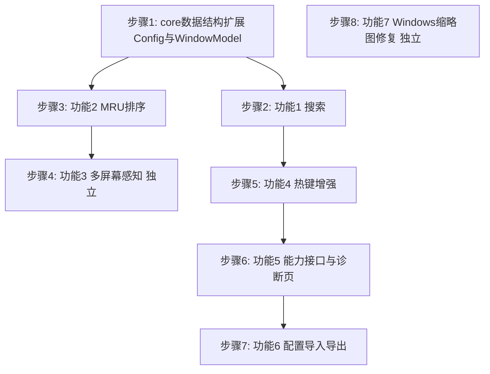

# mySwitcher v0.2 功能改进设计文档（执行版）

> 本文档面向执行开发的工程师或 AI 模型，所有设计决策已定稿，执行时不需要再做架构选择。
> 每个功能章节均包含：现状与问题、数据结构与接口设计、逐文件改动清单、i18n 新增文案、验收标准、边界与回退。
> 请严格按照第 2 节的实施顺序执行。

## 1. 版本目标与范围

### 1.1 目标

在不扩大高风险平台范围的前提下，完成 v0.2 的七项改进：

1. 面板关键字搜索
2. 最近使用排序（MRU）
3. 多屏幕感知
4. 热键增强（录入范围扩展、失败提示分级、免重启生效）
5. 平台能力诊断页
6. 配置导入导出
7. Windows 缩略图截取修复

### 1.2 非目标（明确不做）

- macOS 全局热键底层实现（`HotkeyManager_mac.mm` 保持占位，但要正确报告"平台不支持"）
- macOS 关闭窗口底层实现
- Linux X11 全局热键底层实现（同上，只完善错误报告）
- Wayland 深度适配
- 大规模视觉改版

### 1.3 全局架构约束

- 保持现有 `core / ui / app / platform` 四层结构，不新增顶层目录。
- 所有用户可见文案必须通过 `I18n` 类提供中英双语，禁止在 UI 代码中硬编码文案（现有 `SettingsDialog.cpp` 第 66 行的 `"Save"` 硬编码属于历史遗留，本次一并修复）。
- `config.json` 格式只增不改：新增字段缺失时使用默认值，旧版本配置文件必须能被 v0.2 正常加载。
- 新增源文件要同步登记到 `CMakeLists.txt` 对应的 `*_SOURCES` 变量。

## 2. 实施顺序与依赖

按以下顺序执行，每步完成后应能独立编译通过：



依赖说明：

- 功能 1、2 都依赖 `WindowModel` / `Config` 的结构扩展，先做。
- 功能 3、7 相对独立，可以穿插执行。
- 功能 5 的诊断页需要功能 4 定义的热键错误分级（`HotkeyError`），所以热键增强在前。
- 功能 6 的导入导出依赖 `Config` 字段全部定稿（含功能 2 新增的 MRU 字段），放在最后的功能开发位。

---

## 3. 功能 1：面板关键字搜索

### 3.1 现状与问题

- `src/core/WindowModel.h` 的 `AppState`（31–49 行）只有按应用过滤（`Filter` / `FilterKind::OnlyApp`），没有文本搜索状态。
- `AppState::visibleGroups()`（`WindowModel.cpp` 85–95 行）返回 `QVector<const AppGroup *>`，只按 `filter` 过滤组，不能过滤组内窗口。
- `src/ui/SwitcherPanel.cpp` 的 `rebuild()`（34–173 行）每次都销毁并重建整个布局，顶部是应用筛选 pill 行，没有搜索输入框。若把搜索框放在 `rebuild()` 内创建，每次按键触发重建都会销毁搜索框导致丢失焦点，因此必须把搜索框移出重建范围。

### 3.2 数据结构与接口设计

#### 3.2.1 `AppState` 扩展（`src/core/WindowModel.h`）

```cpp
struct AppState {
    QVector<AppGroup> groups;
    Filter filter;
    QString searchText;          // 新增：搜索关键字，空串表示无搜索
    int selectedGroup = 0;
    int selectedWindow = 0;

    static AppState create(const QVector<AppGroup> &groups, const Filter &filter);

    // 返回类型由 QVector<const AppGroup *> 改为 QVector<AppGroup>（值语义）。
    // 返回的组内窗口已按 searchText 过滤，无匹配窗口的组不返回。
    QVector<AppGroup> visibleGroups() const;

    qint64 selectedWindowId() const;
    void setSearchText(const QString &text);   // 新增
    void removeWindow(qint64 windowId);
    void removeGroup(const QString &exePath);
    void setPinned(const QStringList &pinned);
    void moveSelection(int dy, int dx);

private:
    void clampSelection();
};
```

设计决策：`visibleGroups()` 改为返回值拷贝而不是指针，是因为搜索需要"组保留、但组内只保留匹配窗口"的窗口级过滤，指针方案无法表达。窗口数量级（几十个）下拷贝开销可忽略。

#### 3.2.2 匹配规则（`src/core/WindowModel.cpp`）

`visibleGroups()` 的新实现逻辑：

```cpp
QVector<AppGroup> AppState::visibleGroups() const {
    QVector<AppGroup> out;
    const QString needle = searchText.trimmed();
    for (const AppGroup &g : groups) {
        // 第一层：沿用现有应用过滤
        if (filter.kind == FilterKind::OnlyApp && filter.exePath != g.exePath) {
            continue;
        }
        if (needle.isEmpty()) {
            out.append(g);
            continue;
        }
        // 第二层：文本搜索（全部不区分大小写的"包含"匹配）
        if (g.appName.contains(needle, Qt::CaseInsensitive)) {
            out.append(g);           // 应用名命中：整组保留
            continue;
        }
        AppGroup filtered = g;
        filtered.windows.clear();
        for (const WindowItem &w : g.windows) {
            if (w.title.contains(needle, Qt::CaseInsensitive)
                || w.folderPath.contains(needle, Qt::CaseInsensitive)) {
                filtered.windows.append(w);
            }
        }
        if (!filtered.windows.isEmpty()) {
            out.append(filtered);    // 标题/路径命中：只保留匹配窗口
        }
    }
    return out;
}

void AppState::setSearchText(const QString &text) {
    if (searchText == text) {
        return;
    }
    searchText = text;
    selectedGroup = 0;
    selectedWindow = 0;
    clampSelection();
}
```

匹配规则汇总：

| 匹配字段 | 命中效果 |
|---|---|
| `AppGroup.appName` 包含关键字 | 整组全部窗口保留 |
| `WindowItem.title` 包含关键字 | 该窗口保留 |
| `WindowItem.folderPath` 包含关键字 | 该窗口保留 |
| 组内无任何窗口命中且组名不命中 | 整组隐藏 |

#### 3.2.3 返回类型变更的连锁修改

`visibleGroups()` 返回类型变化后，以下调用点需要同步调整（把 `const AppGroup *g = vis.at(gi)` 改成 `const AppGroup &g = vis.at(gi)`，`g->` 改成 `g.`）：

| 位置 | 现状行号 |
|---|---|
| `AppState::selectedWindowId()` | `WindowModel.cpp` 97–109 |
| `AppState::clampSelection()` | `WindowModel.cpp` 154–164 |
| `AppState::moveSelection()` | `WindowModel.cpp` 166–197 |
| `SwitcherPanel::rebuild()` 内容区循环 | `SwitcherPanel.cpp` 111–169 |

#### 3.2.4 `SwitcherPanel` UI 改造（`src/ui/SwitcherPanel.h/.cpp`）

结构调整——把布局骨架从 `rebuild()` 移到构造函数，`rebuild()` 只重建可变部分：

```cpp
// SwitcherPanel.h 新增成员
class QLineEdit;
...
private:
    void rebuild();                       // 只重建 filter 行 + 内容区
    bool eventFilter(QObject *obj, QEvent *event) override;   // 新增

    QLineEdit *m_searchEdit = nullptr;    // 新增：常驻搜索框
    QWidget *m_dynamicHost = nullptr;     // 新增：filter 行 + 内容区的宿主，rebuild 只重建它的内容
```

构造函数中建立骨架：

```cpp
SwitcherPanel::SwitcherPanel(I18n i18n, QWidget *parent) : QWidget(parent), m_i18n(i18n) {
    setObjectName(QStringLiteral("SwitcherPanel"));
    auto *root = new QVBoxLayout(this);
    root->setContentsMargins(10, 10, 10, 10);
    root->setSpacing(8);

    m_searchEdit = new QLineEdit;
    m_searchEdit->setObjectName(QStringLiteral("SearchEdit"));
    m_searchEdit->setPlaceholderText(m_i18n.searchPlaceholder());
    m_searchEdit->setClearButtonEnabled(true);
    m_searchEdit->installEventFilter(this);
    connect(m_searchEdit, &QLineEdit::textChanged, this, [this](const QString &text) {
        m_state.setSearchText(text);
        rebuild();
    });
    root->addWidget(m_searchEdit);

    m_dynamicHost = new QWidget;
    new QVBoxLayout(m_dynamicHost);   // rebuild 时清空并重填这个 layout
    m_dynamicHost->layout()->setContentsMargins(0, 0, 0, 0);
    root->addWidget(m_dynamicHost, 1);
}
```

`rebuild()` 改为：清空并重建 `m_dynamicHost` 的 layout 内容（原 34–42 行的清空逻辑改为作用于 `m_dynamicHost->layout()`），filter 行与内容区的构建代码不变，只是 `addWidget` 目标从 `root` 改为 `m_dynamicHost` 的 layout。

`setData()` 中重置搜索状态（面板每次唤出时搜索框清空）：

```cpp
void SwitcherPanel::setData(...) {
    m_state = state;
    ...
    m_searchEdit->blockSignals(true);   // 避免 textChanged 触发一次多余 rebuild
    m_searchEdit->clear();
    m_searchEdit->blockSignals(false);
    rebuild();
    m_searchEdit->setFocus();           // 唤出即可直接打字
}
```

注意：`updateTextures()`（`SwitcherPanel.cpp` 28–32 行）也调用 `rebuild()`，不要在其中动搜索框，保持用户输入。

#### 3.2.5 键盘分工（`eventFilter`）

搜索框持有焦点，普通字符进入搜索；导航键转发给面板逻辑：

```cpp
bool SwitcherPanel::eventFilter(QObject *obj, QEvent *event) {
    if (obj == m_searchEdit && event->type() == QEvent::KeyPress) {
        auto *ke = static_cast<QKeyEvent *>(event);
        switch (ke->key()) {
        case Qt::Key_Up:
        case Qt::Key_Down:
        case Qt::Key_Return:
        case Qt::Key_Enter:
        case Qt::Key_Escape:
            keyPressEvent(ke);   // 复用现有导航实现（SwitcherPanel.cpp 175–210 行）
            return true;
        default:
            break;
        }
    }
    return QWidget::eventFilter(obj, event);
}
```

左右方向键保留给搜索框内的光标移动，不转发（组内横向切换在搜索场景下用 Up/Down 已够用）。

Esc 的语义分两级：搜索框有内容时第一次 Esc 清空搜索，第二次 Esc 关闭面板。在 `keyPressEvent` 的 `Qt::Key_Escape` 分支前插入：

```cpp
case Qt::Key_Escape:
    if (!m_searchEdit->text().isEmpty()) {
        m_searchEdit->clear();   // textChanged 会触发 setSearchText + rebuild
        break;
    }
    emitAction({MainWindow::PanelActionType::Dismiss});
    break;
```

### 3.3 逐文件改动清单

| 文件 | 改动 |
|---|---|
| `src/core/WindowModel.h` | `AppState` 增加 `searchText` 字段、`setSearchText()` 声明；`visibleGroups()` 返回类型改为 `QVector<AppGroup>` |
| `src/core/WindowModel.cpp` | 实现新 `visibleGroups()` 与 `setSearchText()`；`selectedWindowId` / `clampSelection` / `moveSelection` 适配新返回类型 |
| `src/ui/SwitcherPanel.h` | 新增 `m_searchEdit`、`m_dynamicHost` 成员与 `eventFilter` 声明；include `<QLineEdit>` 前置声明 |
| `src/ui/SwitcherPanel.cpp` | 构造函数建骨架；`rebuild()` 只重建动态区；`setData()` 清空搜索并聚焦；`eventFilter` 转发导航键；Esc 两级语义 |
| `src/core/I18n.h/.cpp` | 新增 `searchPlaceholder()` |
| `resources/styles/app.qss` | 为 `#SearchEdit` 增加与面板风格一致的样式（圆角、内边距，可参考 `FilterPill` 的既有样式写法） |

### 3.4 i18n 新增文案

| 方法名 | 中文 | 英文 |
|---|---|---|
| `searchPlaceholder()` | `搜索窗口标题、应用名或路径…` | `Search title, app or path...` |

### 3.5 验收标准

1. 热键唤出面板后直接输入 `note`，列表实时收敛为标题/应用名/路径包含 `note` 的窗口（不区分大小写）。
2. 关键字命中某应用名（如 `explorer`）时，该应用整组窗口全部显示。
3. 关键字只命中某窗口标题时，该组仅显示命中的窗口，其余窗口隐藏；无命中窗口的组整组消失。
4. 搜索状态下 Up/Down 可在结果中移动选择，Enter 激活选中窗口。
5. 搜索框有内容时按 Esc 清空搜索恢复完整列表；再按 Esc 关闭面板。
6. 关闭面板再次唤出，搜索框为空、显示完整列表。
7. 无任何匹配时内容区为空白（不崩溃），`selectedWindowId()` 返回 0，按 Enter 无动作。

### 3.6 边界与回退

- 搜索为纯内存过滤，不涉及配置持久化，无回退风险。
- `visibleGroups()` 返回类型变更是本功能最大的连锁点，改完后全项目搜索 `visibleGroups` 确认无遗漏调用点。

---

## 4. 功能 2：MRU 最近使用排序

### 4.1 现状与问题

- 窗口激活路径：`ApplicationController::onPanelAction()` 的 `Activate` 分支（`src/app/Application.cpp` 194–197 行）只调用 `m_windowSource->activate()` 后 `hideAll()`，没有任何状态写回。
- 组排序：`buildGroups()`（`src/core/WindowModel.cpp` 67–72 行）只按 `pinned` 做 `stable_sort`，pinned 之后是枚举原序。
- `Config`（`src/core/Config.h` 6–13 行）没有承载 MRU 数据的字段。

### 4.2 数据结构与接口设计

#### 4.2.1 排序优先级（定稿，不可更改）

组排序：**pinned 降序 > MRU 时间降序 > 枚举原序**（用 `std::stable_sort` 保证第三级）。
组内窗口排序：**窗口级 MRU 时间降序 > 枚举原序**；例外：explorer 组维持现有按 `folderPath` 排序（`WindowModel.cpp` 57–63 行），不参与窗口级 MRU。

#### 4.2.2 `Config` 扩展（`src/core/Config.h`）

```cpp
struct Config {
    ...
    QStringList excluded = {QStringLiteral("TextInputHost.exe")};
    bool mruEnabled = true;                 // 新增：MRU 总开关
    QHash<QString, qint64> mruTimes;        // 新增：exe 文件名(小写) -> 最近激活毫秒时间戳
    ...
};
```

JSON 序列化（`Config.cpp` 的 `toJson` / `fromJson`）：

```json
{
  "mru_enabled": true,
  "mru": { "notepad.exe": 1791234567890, "chrome.exe": 1791234500000 }
}
```

- `toJson`：写入 `mru_enabled`（bool）与 `mru`（object，值为 double——`QJsonValue` 无 int64，用 `static_cast<double>` 写入，毫秒时间戳在 double 的 53 位精度内无损）。
- `fromJson`：`mru_enabled` 缺省 true；`mru` 缺省空表；遍历 object 时 key 统一 `toLower()`。
- **修剪规则**：`save()` 前若 `mruTimes.size() > 50`，删除时间戳最小的条目直到剩 50 条。实现为 `Config` 的私有辅助或 `save()` 内联逻辑。
- `operator==`（`Config.cpp` 124–132 行）追加 `mruEnabled` 与 `mruTimes` 两项比较。

设计决策：只持久化组级（exe 级）MRU；窗口级 MRU 因 `windowId`（HWND）跨会话无意义，仅保存在内存。

#### 4.2.3 `buildGroups` 签名扩展（`src/core/WindowModel.h/.cpp`）

```cpp
QVector<AppGroup> buildGroups(
    const QList<RawWindow> &raws,
    const QStringList &pinned,
    const QStringList &excluded,
    const QHash<QString, qint64> &groupMru,     // 新增：exe文件名(小写) -> 时间戳；MRU 关闭时传空表
    const QHash<qint64, qint64> &windowMru);    // 新增：windowId -> 时间戳；MRU 关闭时传空表
```

实现改动（在现有 `WindowModel.cpp` 54–73 行区域）：

```cpp
    // 组内窗口排序：explorer 保持原有路径排序；其余组按窗口 MRU 降序
    for (const QString &key : order) {
        AppGroup g = map.take(key);
        if (exeFileName(g.exePath) == QStringLiteral("explorer.exe")) {
            /* 现有 folderPath 排序不变 */
        } else if (!windowMru.isEmpty()) {
            std::stable_sort(g.windows.begin(), g.windows.end(),
                [&windowMru](const WindowItem &a, const WindowItem &b) {
                    return windowMru.value(a.windowId, 0) > windowMru.value(b.windowId, 0);
                });
        }
        groups.append(g);
    }

    // 组排序：pinned > MRU 降序 > 原序
    std::stable_sort(groups.begin(), groups.end(),
        [&groupMru](const AppGroup &a, const AppGroup &b) {
            if (a.pinned != b.pinned) {
                return a.pinned > b.pinned;
            }
            const qint64 ta = groupMru.value(exeFileName(a.exePath), 0);
            const qint64 tb = groupMru.value(exeFileName(b.exePath), 0);
            return ta > tb;
        });
```

注意 `exeFileName` 目前在 `WindowModel.cpp` 的匿名 namespace（8–11 行），lambda 可以直接使用，无需移动。

#### 4.2.4 激活写回（`src/app/Application.h/.cpp`）

`ApplicationController` 新增成员与私有方法：

```cpp
    QHash<qint64, qint64> m_windowMru;   // 会话内窗口级 MRU
    void recordActivation(qint64 windowId);
```

```cpp
void ApplicationController::recordActivation(qint64 windowId) {
    if (!m_config.mruEnabled) {
        return;
    }
    const qint64 now = QDateTime::currentMSecsSinceEpoch();
    m_windowMru.insert(windowId, now);
    for (const AppGroup &g : m_state.groups) {
        for (const WindowItem &w : g.windows) {
            if (w.windowId == windowId) {
                const QString fname = g.exePath
                    .section('/', -1).section('\\', -1).toLower();
                m_config.mruTimes.insert(fname, now);
                m_config.save();
                return;
            }
        }
    }
}
```

在 `onPanelAction()` 的 `Activate` 分支（`Application.cpp` 194–197 行）激活前调用：

```cpp
    case MainWindow::PanelActionType::Activate:
        recordActivation(action.windowId);
        m_windowSource->activate(action.windowId);
        hideAll();
        break;
```

`refreshWindows()`（`Application.cpp` 110 行）的 `buildGroups` 调用更新为：

```cpp
    const QVector<AppGroup> groups = buildGroups(
        raws, m_config.pinned, m_config.excluded,
        m_config.mruEnabled ? m_config.mruTimes : QHash<QString, qint64>{},
        m_config.mruEnabled ? m_windowMru : QHash<qint64, qint64>{});
```

同时在 `refreshWindows()` 清理 `m_windowMru` 中已不存在的窗口（复用其中已有的 `ids` 集合，与 121–134 行清理 `m_icons`/`m_thumbs` 的写法一致）。

#### 4.2.5 设置项

`SettingsDialog` 常规页在"显示窗口缩略图"复选框下方新增复选框 `m_mruEnabled`（`QCheckBox`，文案 `mruEnabled()`），`setConfig` / `saveFromUi` 同步该字段。

### 4.3 逐文件改动清单

| 文件 | 改动 |
|---|---|
| `src/core/Config.h` | 新增 `mruEnabled`、`mruTimes` 字段 |
| `src/core/Config.cpp` | `toJson`/`fromJson` 序列化两个新字段；`save()` 前修剪至 50 条；`operator==` 追加比较 |
| `src/core/WindowModel.h` | `buildGroups` 签名加两个 MRU 参数 |
| `src/core/WindowModel.cpp` | 组排序、组内窗口排序按 4.2.3 实现 |
| `src/app/Application.h` | 新增 `m_windowMru` 成员与 `recordActivation` 声明 |
| `src/app/Application.cpp` | `Activate` 分支写回；`refreshWindows` 传参并清理失效窗口；include `<QDateTime>` |
| `src/ui/SettingsDialog.h/.cpp` | 新增 MRU 开关复选框 |
| `src/core/I18n.h/.cpp` | 新增 `mruEnabled()` |

### 4.4 i18n 新增文案

| 方法名 | 中文 | 英文 |
|---|---|---|
| `mruEnabled()` | `按最近使用排序` | `Sort by recently used` |

### 4.5 验收标准

1. 打开面板，激活窗口 A（属于非置顶应用 X），再次打开面板：应用 X 的组排在所有非置顶组的最前面，窗口 A 排在组内第一位。
2. 置顶应用的组始终排在所有非置顶组前面，不被 MRU 影响。
3. explorer 组内仍按文件夹路径字母序排列。
4. 重启应用后，组级顺序仍反映上次使用情况（`config.json` 中 `mru` 已持久化）；组内窗口顺序恢复为枚举原序（窗口级 MRU 不持久化，属预期）。
5. 设置中关闭"按最近使用排序"并保存后，组顺序回到 pinned + 枚举原序。
6. `config.json` 中 `mru` 条目数不超过 50。

### 4.6 边界与回退

- MRU 关闭时传空表，排序退化为现状行为，等价于功能未上线。
- 旧配置文件无 `mru_enabled`/`mru` 键：默认开启、空表，行为安全。

---

## 5. 功能 3：多屏幕感知

### 5.1 现状与问题

`src/ui/MainWindow.cpp` 中 `panelSize()`（31–38 行）与 `centerOnScreen()`（40–48 行）都硬编码 `QApplication::primaryScreen()`，多显示器环境下面板永远出现在主屏，与用户当前操作位置（鼠标所在屏）脱节。

### 5.2 接口设计

`MainWindow` 新增私有方法，并改造两处调用：

```cpp
// MainWindow.h private 区新增
QScreen *targetScreen() const;

// MainWindow.cpp
#include <QCursor>
#include <QGuiApplication>

QScreen *MainWindow::targetScreen() const {
    QScreen *screen = QGuiApplication::screenAt(QCursor::pos());
    if (!screen) {
        screen = QApplication::primaryScreen();   // 回退：鼠标位置无法归属任何屏幕
    }
    return screen;
}
```

`panelSize()` 与 `centerOnScreen()` 中的 `QApplication::primaryScreen()` 均替换为 `targetScreen()`，其余逻辑（70%/62% 比例、clamp 区间、居中计算）不变。

注意调用顺序：`showPanel()`（`MainWindow.cpp` 50–62 行）先 `resize(panelSize())` 再 `centerOnScreen()`，两者会各调一次 `targetScreen()`；期间鼠标不会跨屏（同一次事件循环内），无需缓存。

### 5.3 逐文件改动清单

| 文件 | 改动 |
|---|---|
| `src/ui/MainWindow.h` | 新增 `targetScreen()` 声明；前置声明 `class QScreen;` |
| `src/ui/MainWindow.cpp` | 实现 `targetScreen()`；`panelSize()`、`centerOnScreen()` 改用它 |

无 i18n、无配置变化。

### 5.4 验收标准

1. 双屏环境：鼠标在副屏时按热键，面板在副屏居中出现，尺寸按副屏可用区域计算。
2. 鼠标在主屏时行为与现状一致。
3. 单屏环境行为完全不变。
4. 设置页（`showSettings` 也走 `centerOnScreen`）同样出现在鼠标所在屏。

### 5.5 边界与回退

- `screenAt()` 返回空（鼠标恰在屏幕边界外的死区）时回退主屏，行为等同现状。

---

## 6. 功能 4：热键增强

### 6.1 现状与问题

三个层面的问题：

1. **前后端按键口径不一致**：录入层 `HotkeyEdit::formatKey()`（`src/ui/HotkeyEdit.cpp` 30–60 行）只支持 `A–Z`、`Space`、反引号、`F1–F24`；而 Windows 解析层 `virtualKeyFromToken()`（`src/app/HotkeyManager_win.cpp` 29–66 行）额外支持 `- = , . Tab`。且两边都不支持数字键与方向键。
2. **失败提示不分级**：`HotkeyManager::registerHotkey` 只有一个 `QString *errorMessage`（`src/app/HotkeyManager.h` 12 行），上层无法区分"格式解析失败 / 系统注册失败 / 平台根本不支持"三种情况；macOS 后端（`HotkeyManager_mac.mm`）注册失败时甚至不写错误信息。
3. **改热键需重启**：`ApplicationController::onSettingsSaved()`（`src/app/Application.cpp` 240–244 行）只保存配置，不重新注册热键，托盘 tooltip 也不更新。

### 6.2 接口设计

#### 6.2.1 统一按键映射表（前后端都以此表为准）

| Token（大小写不敏感） | Qt 键值（HotkeyEdit 录入） | Win32 VK（HotkeyManager_win 解析） |
|---|---|---|
| `A`–`Z` | `Qt::Key_A`–`Qt::Key_Z` | `'A'`–`'Z'` |
| `0`–`9` | `Qt::Key_0`–`Qt::Key_9` | `'0'`–`'9'` |
| `F1`–`F24` | `Qt::Key_F1`–`Qt::Key_F24` | `VK_F1`–`VK_F24` |
| `Space` | `Qt::Key_Space` | `VK_SPACE` |
| `Tab` | `Qt::Key_Tab` | `VK_TAB` |
| `` ` `` | `Qt::Key_QuoteLeft` | `VK_OEM_3` |
| `-` | `Qt::Key_Minus` | `VK_OEM_MINUS` |
| `=` | `Qt::Key_Equal` | `VK_OEM_PLUS` |
| `,` | `Qt::Key_Comma` | `VK_OEM_COMMA` |
| `.` | `Qt::Key_Period` | `VK_OEM_PERIOD` |
| `;` | `Qt::Key_Semicolon` | `VK_OEM_1` |
| `'` | `Qt::Key_Apostrophe` | `VK_OEM_7` |
| `[` | `Qt::Key_BracketLeft` | `VK_OEM_4` |
| `]` | `Qt::Key_BracketRight` | `VK_OEM_6` |
| `/` | `Qt::Key_Slash` | `VK_OEM_2` |
| `\` | `Qt::Key_Backslash` | `VK_OEM_5` |
| `Up` / `Down` / `Left` / `Right` | `Qt::Key_Up` 等 | `VK_UP` / `VK_DOWN` / `VK_LEFT` / `VK_RIGHT` |
| `Home` / `End` | `Qt::Key_Home` / `Qt::Key_End` | `VK_HOME` / `VK_END` |
| `PgUp` / `PgDn` | `Qt::Key_PageUp` / `Qt::Key_PageDown` | `VK_PRIOR` / `VK_NEXT` |

修饰键不变：`Ctrl` / `Alt` / `Shift` / `Win`（解析层继续兼容 `Control`、`Super` 别名）。

**无修饰键约束**（在 `HotkeyEdit::formatKey` 中实施）：主键为字母、数字或符号时必须至少携带一个修饰键，否则忽略本次录入（避免把普通打字键设为全局热键）；`F1`–`F24` 与方向键/Home/End/PgUp/PgDn 允许无修饰键。

`HotkeyEdit::formatKey()` 的扩充按上表逐项添加 `else if` 分支即可，格式保持 `Ctrl+Alt+Shift+Win+Key` 的 `+` 连接。`virtualKeyFromToken()` 同步添加缺失分支（数字、`; ' [ ] / \`、方向键、Home/End/PgUp/PgDn）。

#### 6.2.2 错误分级（`src/app/HotkeyManager.h`）

```cpp
class HotkeyManager : public QObject {
public:
    enum class HotkeyError {
        None,
        ParseFailed,           // 热键字符串无法解析
        RegisterFailed,        // 平台支持但系统注册失败（冲突/权限等）
        PlatformUnsupported    // 当前平台没有全局热键实现
    };

    bool registerHotkey(const QString &hotkey, QString *errorMessage = nullptr);
    void unregisterHotkey();
    HotkeyError lastError() const { return m_lastError; }
    ...
private:
    HotkeyError m_lastError = HotkeyError::None;   // 各后端在失败路径上设置
```

各后端设置规则：

| 后端 | 设置点 |
|---|---|
| `HotkeyManager_win.cpp` | `parseHotkey` 失败 → `ParseFailed`；`RegisterHotKey` 失败 → `RegisterFailed`；成功 → `None` |
| `HotkeyManager_linux.cpp` | `parseHotkey`/`platformRegister` → `PlatformUnsupported`，并写 errorMessage（保持现有 X11 提示文案） |
| `HotkeyManager_mac.mm` | `platformRegister` → `PlatformUnsupported`，**补写** errorMessage（如 `"Global hotkeys are not implemented on macOS yet."`） |

`m_lastError` 成员放在 `HotkeyManager.h` 的公共私有区（不放平台 `#if` 块内），由共享的 `HotkeyManager.cpp` 中 `registerHotkey` 在调用前重置为 `None`。

#### 6.2.3 保存后即时重注册（`src/app/Application.cpp`）

重写 `onSettingsSaved`：

```cpp
void ApplicationController::onSettingsSaved(const Config &cfg) {
    const QString oldHotkey = m_config.hotkey;
    m_config = cfg;
    m_config.save();

    if (m_config.hotkey != oldHotkey) {
        m_hotkey->unregisterHotkey();
        QString err;
        if (!m_hotkey->registerHotkey(m_config.hotkey, &err)) {
            const auto kind = m_hotkey->lastError();
            // 回滚到旧热键，保证应用仍可唤出
            QString rollbackErr;
            m_hotkey->registerHotkey(oldHotkey, &rollbackErr);
            m_config.hotkey = oldHotkey;
            m_config.save();
            const QString reason = (kind == HotkeyManager::HotkeyError::PlatformUnsupported)
                ? m_i18n.hotkeyPlatformUnsupported()
                : m_i18n.hotkeyFailedMessage(cfg.hotkey, err);
            QMessageBox::warning(m_mainWindow, m_i18n.hotkeyFailedTitle(),
                                 m_i18n.hotkeyRolledBack(oldHotkey, reason));
        }
        m_tray->setToolTip(m_i18n.trayTooltip(m_config.hotkey));
    }
    hideAll();
}
```

同时更新设置页提示：`I18n::hotkeyHint()` 现有文案若包含"需重启"，改为说明保存后立即生效（语言切换仍需重启，`languageRestartHint()` 不动）。

启动时注册失败的现有提示（`Application.cpp` 50–56 行）改为同样按 `lastError()` 分流：`PlatformUnsupported` 用 `hotkeyPlatformUnsupported()` 文案，其余保持 `hotkeyFailedMessage`。

### 6.3 逐文件改动清单

| 文件 | 改动 |
|---|---|
| `src/ui/HotkeyEdit.cpp` | `formatKey()` 按 6.2.1 表扩充；实施无修饰键约束 |
| `src/app/HotkeyManager.h` | 新增 `HotkeyError` 枚举、`lastError()`、`m_lastError` |
| `src/app/HotkeyManager.cpp` | `registerHotkey` 入口重置 `m_lastError` |
| `src/app/HotkeyManager_win.cpp` | `virtualKeyFromToken` 扩充；失败路径设置错误类型 |
| `src/app/HotkeyManager_linux.cpp` | 失败路径设置 `PlatformUnsupported` |
| `src/app/HotkeyManager_mac.mm` | 失败路径设置 `PlatformUnsupported` 并写 errorMessage |
| `src/app/Application.cpp` | `onSettingsSaved` 重注册 + 回滚；启动失败提示分流；托盘 tooltip 更新 |
| `src/core/I18n.h/.cpp` | 新增 `hotkeyPlatformUnsupported()`、`hotkeyRolledBack()`；修订 `hotkeyHint()` |

### 6.4 i18n 新增/修订文案

| 方法名 | 中文 | 英文 |
|---|---|---|
| `hotkeyPlatformUnsupported()` | `当前平台尚未支持全局热键，请通过托盘图标唤出面板` | `Global hotkeys are not supported on this platform yet. Use the tray icon to open the panel.` |
| `hotkeyRolledBack(old, reason)` | `新热键设置失败，已恢复为 %1。原因：%2` | `Failed to apply the new hotkey; restored %1. Reason: %2` |
| `hotkeyHint()`（修订） | `点击后按下组合键；保存后立即生效` | `Click and press a combination; applies immediately after saving` |

### 6.5 验收标准

1. 设置页可录入 `Ctrl+1`、`Ctrl+Alt+.`、`F9`、`Win+Up` 等组合，录入结果与显示一致。
2. 单独按下字母/数字键（无修饰键）不会被录入；单独按 `F9` 可以。
3. Windows 上录入层能产生的每一种热键字符串都能被解析注册成功（用上表逐类抽验）。
4. 保存新热键后不重启即可用新热键唤出面板，旧热键失效，托盘 tooltip 显示新热键。
5. 设置一个已被系统占用的热键（如 `Win+L` 不可注册类）时，弹出回滚提示，旧热键仍然可用。
6. 在 Linux/macOS 构建上（如可验证），注册失败提示明确为"平台不支持"而非笼统的注册失败。

### 6.6 边界与回退

- 回滚注册失败（极端情况：旧热键也注册不回来）时应用仍可通过托盘双击唤出，不致完全失联。
- 录入层与解析层的映射表将来若再扩充，必须两边同步修改——在两处代码各加一行注释指向本文档 6.2.1 表。

---

## 7. 功能 5：平台能力诊断页

### 7.1 现状与问题

- 平台能力差异（Windows 全能力 / macOS 无关闭无图标 / Linux Wayland 全不可用）只隐式体现在各实现返回空或 no-op，代码中没有 capabilities 查询接口（全仓库无 `capabilit` 符号）。
- `SettingsDialog`（`src/ui/SettingsDialog.cpp`）是单页 `QWidget`，没有诊断信息；用户无法自查平台、会话类型、日志路径。

### 7.2 数据结构与接口设计

#### 7.2.1 能力结构（新文件 `src/platform/PlatformCapabilities.h`）

```cpp
#pragma once

#include <QString>

enum class CapabilityLevel {
    Full,      // 完整支持
    Partial,   // 部分支持（有已知限制）
    None       // 不支持
};

struct PlatformCapabilities {
    QString platformName;    // "Windows" / "macOS" / "Linux"
    QString sessionType;     // Windows/macOS 填 "Desktop"；Linux 填 "X11" 或 "Wayland"
    CapabilityLevel hotkey = CapabilityLevel::None;      // 全局热键
    CapabilityLevel activate = CapabilityLevel::None;    // 精确激活窗口
    CapabilityLevel closeWindow = CapabilityLevel::None; // 关闭窗口
    CapabilityLevel icon = CapabilityLevel::None;        // 窗口图标
    CapabilityLevel thumbnail = CapabilityLevel::None;   // 窗口缩略图
    CapabilityLevel folderPath = CapabilityLevel::None;  // 文件管理器路径
};

PlatformCapabilities queryPlatformCapabilities();
```

#### 7.2.2 各平台实现

沿用现有工厂模式（`src/platform/PlatformFactory.cpp` 的 `createXxxImpl` 约定）：各平台源文件实现 `queryPlatformCapabilitiesImpl()`，`PlatformFactory.cpp` 转发。

各平台返回值（依据当前实现现状定稿）：

| 能力 | Windows | macOS | Linux X11 | Linux Wayland |
|---|---|---|---|---|
| hotkey | Full | None | None | None |
| activate | Full | Partial（应用级激活） | Full | None |
| closeWindow | Full | None | Full | None |
| icon | Full | None | None | None |
| thumbnail | Full | Partial（macOS 15+ SDK 编译时不可用） | Partial（无降采样） | None |
| folderPath | Full | Partial（用标题近似） | None | None |

实现位置：

- `WinWindowSource.cpp` 末尾追加 `queryPlatformCapabilitiesImpl()`，全 Full，`platformName = "Windows"`、`sessionType = "Desktop"`。
- `MacWindowSource.mm` 追加实现，按上表；thumbnail 用与现有 `__MAC_OS_X_VERSION_MAX_ALLOWED >= 150000` 一致的条件编译返回 None/Partial。
- `LinuxWindowSource.cpp` 追加实现，运行期用文件内已有的 `isWaylandSession()` 判断填 X11 列或 Wayland 列。

#### 7.2.3 `SettingsDialog` 改造为双页签

```cpp
// SettingsDialog.cpp buildUi() 骨架改为：
auto *layout = new QVBoxLayout(this);
auto *tabs = new QTabWidget;
tabs->addTab(buildGeneralTab(), m_i18n.settingsTabGeneral());     // 现有全部控件迁入
tabs->addTab(buildDiagnosticsTab(), m_i18n.settingsTabDiagnostics());
layout->addWidget(tabs);
```

- `buildGeneralTab()`：把现有 `buildUi()` 的全部内容（26–69 行）原样迁入一个 `QWidget`；`Save` 按钮文案改为 `m_i18n.saveButton()`（消除硬编码）。
- `buildDiagnosticsTab()`：只读信息页，`QFormLayout` 展示：

| 行 | 内容来源 |
|---|---|
| 应用版本 | `MYSWITCHER_VERSION` 编译宏（见 7.2.4） |
| 平台 | `caps.platformName` |
| 会话类型 | `caps.sessionType` |
| 全局热键 / 激活窗口 / 关闭窗口 / 窗口图标 / 窗口缩略图 / 文件夹路径 | 六项能力，按 `capabilityText()` 渲染 |
| 配置文件 | `Config::configPath()`（可选中复制的 `QLabel`，`setTextInteractionFlags(Qt::TextSelectableByMouse)`） |
| 日志文件 | `Config::logPath()`（同上） |
| 打开数据目录按钮 | `QDesktopServices::openUrl(QUrl::fromLocalFile(Config::dataDir()))` |

能力等级渲染函数（`SettingsDialog.cpp` 匿名 namespace）：

```cpp
QString capabilityText(CapabilityLevel level, const I18n &i18n) {
    switch (level) {
    case CapabilityLevel::Full:    return QStringLiteral("✓ ") + i18n.capabilityFull();
    case CapabilityLevel::Partial: return QStringLiteral("△ ") + i18n.capabilityPartial();
    case CapabilityLevel::None:    return QStringLiteral("✗ ") + i18n.capabilityNone();
    }
    return {};
}
```

#### 7.2.4 版本号宏（`CMakeLists.txt`）

在 `target_include_directories` 附近追加：

```cmake
target_compile_definitions(mySwitcher PRIVATE
    MYSWITCHER_VERSION="${PROJECT_VERSION}"
)
```

同时将 `project(mySwitcher VERSION 0.1.0 ...)` 升为 `0.2.0`。

#### 7.2.5 设置窗口尺寸

`MainWindow::showSettings()`（`MainWindow.cpp` 64–72 行）的 `resize(460, 520)` 改为 `resize(520, 560)`，容纳页签。

### 7.3 逐文件改动清单

| 文件 | 改动 |
|---|---|
| `src/platform/PlatformCapabilities.h` | 新建：枚举、结构体、`queryPlatformCapabilities()` 声明 |
| `src/platform/PlatformFactory.cpp` | 声明并转发 `queryPlatformCapabilitiesImpl()` |
| `src/platform/windows/WinWindowSource.cpp` | 实现 Windows 能力表 |
| `src/platform/macos/MacWindowSource.mm` | 实现 macOS 能力表 |
| `src/platform/linux/LinuxWindowSource.cpp` | 实现 Linux 能力表（区分 X11/Wayland） |
| `src/ui/SettingsDialog.h/.cpp` | 改双页签；新增诊断页；`Save` 改 i18n |
| `src/ui/MainWindow.cpp` | 设置窗口尺寸调整 |
| `src/core/I18n.h/.cpp` | 新增诊断页全部文案 |
| `CMakeLists.txt` | 版本升 0.2.0；`MYSWITCHER_VERSION` 宏 |

### 7.4 i18n 新增文案

| 方法名 | 中文 | 英文 |
|---|---|---|
| `settingsTabGeneral()` | `常规` | `General` |
| `settingsTabDiagnostics()` | `诊断` | `Diagnostics` |
| `saveButton()` | `保存` | `Save` |
| `diagAppVersion()` | `应用版本` | `App version` |
| `diagPlatform()` | `平台` | `Platform` |
| `diagSessionType()` | `会话类型` | `Session type` |
| `diagHotkey()` | `全局热键` | `Global hotkey` |
| `diagActivate()` | `激活窗口` | `Activate window` |
| `diagCloseWindow()` | `关闭窗口` | `Close window` |
| `diagIcon()` | `窗口图标` | `Window icon` |
| `diagThumbnail()` | `窗口缩略图` | `Window thumbnail` |
| `diagFolderPath()` | `文件夹路径` | `Folder path` |
| `diagConfigPath()` | `配置文件` | `Config file` |
| `diagLogPath()` | `日志文件` | `Log file` |
| `diagOpenDataDir()` | `打开数据目录` | `Open data folder` |
| `capabilityFull()` | `支持` | `Supported` |
| `capabilityPartial()` | `部分支持` | `Partial` |
| `capabilityNone()` | `不支持` | `Not supported` |

### 7.5 验收标准

1. 设置界面出现"常规 / 诊断"两个页签，常规页功能与改造前一致。
2. Windows 上诊断页六项能力全部显示"✓ 支持"，平台为 Windows，版本号为 0.2.0。
3. 配置文件与日志文件路径正确显示且可鼠标选中复制；"打开数据目录"按钮能在资源管理器中打开对应目录。
4. （如可验证）Linux Wayland 会话下会话类型显示 Wayland，各能力显示"✗ 不支持"。

### 7.6 边界与回退

- 能力表是静态描述（少量运行期分支），实现极轻，不引入运行期探测失败的风险。
- 若某平台实现遗漏 `queryPlatformCapabilitiesImpl` 会在链接期报错，不会静默出错。

---

## 8. 功能 6：配置导入导出

### 8.1 现状与问题

- `Config`（`src/core/Config.cpp`）只有面向固定路径 `config.json` 的 `load()`/`save()`，没有面向任意路径的导入导出。
- `SettingsDialog` 无导入导出入口。
- 既有 bug：`SettingsDialog::setConfig()`（`SettingsDialog.cpp` 18–24 行）不同步语言单选按钮，导入配置后语言选项会显示错误，本功能必须修复。

### 8.2 接口设计

#### 8.2.1 `Config` 新增 API（`src/core/Config.h/.cpp`）

```cpp
struct Config {
    ...
    bool exportTo(const QString &path, QString *error = nullptr) const;
    static bool importFrom(const QString &path, Config *out, QString *error = nullptr);
};
```

实现要点（复用文件内已有的 `toJson` / `fromJson`）：

```cpp
bool Config::exportTo(const QString &path, QString *error) const {
    QFile file(path);
    if (!file.open(QIODevice::WriteOnly | QIODevice::Truncate)) {
        if (error) *error = file.errorString();
        return false;
    }
    file.write(QJsonDocument(toJson(*this)).toJson(QJsonDocument::Indented));
    return true;
}

bool Config::importFrom(const QString &path, Config *out, QString *error) {
    QFile file(path);
    if (!file.open(QIODevice::ReadOnly)) {
        if (error) *error = file.errorString();
        return false;
    }
    QJsonParseError parseError{};
    const QJsonDocument doc = QJsonDocument::fromJson(file.readAll(), &parseError);
    if (parseError.error != QJsonParseError::NoError) {
        if (error) *error = parseError.errorString();
        return false;
    }
    if (!doc.isObject()) {
        if (error) *error = QStringLiteral("Root is not a JSON object");
        return false;
    }
    Config cfg = fromJson(doc.object());
    if (cfg.hotkey.trimmed().isEmpty()) {
        if (error) *error = QStringLiteral("Field 'hotkey' is empty");
        return false;
    }
    *out = cfg;
    return true;
}
```

校验策略（定稿）：JSON 不合法或根非 object → 拒绝导入；单个字段类型错误 → `fromJson` 已按默认值宽容处理，不拒绝；未知字段 → 忽略；`hotkey` 为空 → 拒绝。

#### 8.2.2 `SettingsDialog` 入口

常规页签底部、Save 按钮上方增加一行两个按钮：

```cpp
auto *ioRow = new QHBoxLayout;
auto *importBtn = new QPushButton(m_i18n.importConfig());
auto *exportBtn = new QPushButton(m_i18n.exportConfig());
ioRow->addWidget(importBtn);
ioRow->addWidget(exportBtn);
ioRow->addStretch();
layout->addLayout(ioRow);
```

行为定稿：

- **导出**：先把 UI 当前状态收集为 `Config`（把 `saveFromUi()` 里 73–97 行的收集逻辑抽成 `Config collectFromUi() const`，`saveFromUi` 与导出共用），再 `QFileDialog::getSaveFileName`（过滤器 `*.json`，默认文件名 `mySwitcher-config.json`），调用 `exportTo`。失败 `QMessageBox::warning`，成功 `QMessageBox::information`。
- **导入**：`QFileDialog::getOpenFileName` → `Config::importFrom`。成功后调用 `setConfig(imported)` 刷新全部控件，并提示"已载入，点击保存后生效"——导入只填充界面，最终仍走用户点 Save → `saved` 信号 → `ApplicationController::onSettingsSaved` 的既有路径（这样功能 4 的热键重注册、MRU 开关等全部自动生效，无需新增编排代码）。失败弹出具体错误。

#### 8.2.3 修复 `setConfig` 的语言同步

`setConfig()` 补充：

```cpp
void SettingsDialog::setConfig(const Config &config) {
    m_config = config;
    m_hotkeyEdit->setHotkey(config.hotkey);
    m_thumbnail->setChecked(config.thumbnail);
    m_mruEnabled->setChecked(config.mruEnabled);          // 功能2新增控件
    m_excluded->setPlainText(config.excluded.join('\n'));
    m_pinned->setPlainText(config.pinned.join('\n'));
    const QString lc = config.language.trimmed().toLower();
    const int langId = (lc == QStringLiteral("zh")) ? 1 : (lc == QStringLiteral("en")) ? 2 : 0;
    if (auto *btn = m_languageGroup->button(langId)) {
        btn->setChecked(true);
    }
}
```

### 8.3 逐文件改动清单

| 文件 | 改动 |
|---|---|
| `src/core/Config.h` | 声明 `exportTo` / `importFrom` |
| `src/core/Config.cpp` | 实现两个方法（含 `QJsonParseError` 校验） |
| `src/ui/SettingsDialog.h` | 声明 `collectFromUi()`、导入导出槽 |
| `src/ui/SettingsDialog.cpp` | 抽取 `collectFromUi()`；新增按钮行与 `QFileDialog` 流程；修复 `setConfig` 语言同步 |
| `src/core/I18n.h/.cpp` | 新增导入导出文案 |

### 8.4 i18n 新增文案

| 方法名 | 中文 | 英文 |
|---|---|---|
| `importConfig()` | `导入配置…` | `Import config...` |
| `exportConfig()` | `导出配置…` | `Export config...` |
| `configFileFilter()` | `JSON 配置文件 (*.json)` | `JSON config files (*.json)` |
| `exportSucceeded(path)` | `配置已导出到 %1` | `Config exported to %1` |
| `exportFailed(err)` | `导出失败：%1` | `Export failed: %1` |
| `importSucceeded()` | `配置已载入，点击保存后生效` | `Config loaded. Click Save to apply.` |
| `importFailed(err)` | `导入失败：%1` | `Import failed: %1` |

### 8.5 验收标准

1. 点击"导出配置"选择路径后生成 JSON 文件，内容包含全部配置字段（含 `mru_enabled`、`mru`），格式化缩进。
2. 修改导出文件中的 `hotkey` 后导入，设置页各控件（含语言单选、MRU 开关）正确反映文件内容；点击保存后新热键立即生效。
3. 导入一个非 JSON 文件（如文本文件）时弹出含解析错误信息的提示，设置页状态不变。
4. 导入 `hotkey` 字段为空串的 JSON 时被拒绝并提示。
5. 导入含未知字段的 JSON 时正常成功（未知字段被忽略）。
6. 导入后不点保存直接关闭设置页，运行配置不发生任何变化。

### 8.6 边界与回退

- 导入不直接落盘、必须经过 Save，误导入可以直接关窗放弃，无破坏性。
- 导出失败（目标只读等）只弹提示，不影响运行状态。

---

## 9. 功能 7：Windows 缩略图截取修复

### 9.1 现状与问题

`src/platform/windows/WinWindowSource.cpp` 的 `WinThumbnailCapture::capture()`（211–251 行）存在 `docs/thumbnail-capture-technical-analysis.md` 定性过的实现缺陷：

1. **尺寸语义错误**：用 `GetClientRect()` 得到客户区尺寸建位图（214–218 行），但 `PrintWindow(hwnd, dc, PW_RENDERFULLCONTENT)` 按整窗（含标题栏与边框）绘制，位图偏小导致内容被裁切，视觉上表现为"只截到标题栏/顶部"。
2. **空白检测太弱**：`isBlank()`（254–272 行）只识别纯黑/纯白整图，识别不了"上半有内容、下半全空"的半截图。
3. **不处理最小化窗口**：`IsIconic` 窗口 `PrintWindow` 结果不可靠，应直接降级。

失败降级路径已存在：`capture()` 返回空 `ImageRgba` 时上层 `ApplicationController::loadTexturesBatch()`（`Application.cpp` 176–180 行）不会插入 `m_thumbs`，`WindowCard` 自动改用图标展示，本次不需要动 UI。

### 9.2 修复设计

重写 `capture()` 的取图与裁剪逻辑：

```cpp
ImageRgba capture(qint64 windowId) override {
    HWND hwnd = reinterpret_cast<HWND>(windowId);
    if (IsIconic(hwnd)) {
        return {};   // 最小化窗口直接降级为图标
    }

    // 1. 整窗矩形（含 Win10/11 的不可见边框与阴影区）
    RECT windowRect{};
    if (!GetWindowRect(hwnd, &windowRect)) {
        return {};
    }
    // 2. 可见内容矩形（DWM 扩展边框，不含阴影）；失败则回退为整窗矩形
    RECT frameRect = windowRect;
    DwmGetWindowAttribute(hwnd, DWMWA_EXTENDED_FRAME_BOUNDS, &frameRect, sizeof(frameRect));

    const int fullW = qMax(1, static_cast<int>(windowRect.right - windowRect.left));
    const int fullH = qMax(1, static_cast<int>(windowRect.bottom - windowRect.top));
    if (fullW < 8 || fullH < 8) {
        return {};
    }

    // 3. 以整窗尺寸建位图，PrintWindow 整窗渲染（修复原实现用客户区尺寸导致的裁切）
    //    …建 DC/位图、PrintWindow(hwnd, memDc, PW_RENDERFULLCONTENT)、GetDIBits，
    //    与现有 222–245 行相同，只是 w/h 换成 fullW/fullH …

    // 4. 按扩展边框裁掉阴影/不可见边框
    const int cropX = qBound(0, static_cast<int>(frameRect.left - windowRect.left), fullW - 1);
    const int cropY = qBound(0, static_cast<int>(frameRect.top - windowRect.top), fullH - 1);
    const int cropW = qBound(1, static_cast<int>(frameRect.right - frameRect.left), fullW - cropX);
    const int cropH = qBound(1, static_cast<int>(frameRect.bottom - frameRect.top), fullH - cropY);
    // 用 QImage::copy(cropX, cropY, cropW, cropH) 实现裁剪（转 QImage 处理后转回 ImageRgba），
    // BGRA→RGBA 交换与 alpha 置 255 保持现有 246–249 行逻辑。

    // 5. 增强空白检测（见 9.2.1）后再 downscale
    ...
}
```

#### 9.2.1 半截图检测（替换/增强 `isBlank`）

在 `downscale` 前增加行采样检测，新增静态函数：

```cpp
// 均匀采样 16 行，计算每行 RGB 的极差（max-min），极差 < 8 视为"平坦行"。
// 判定规则：
//  a) 全部采样行平坦 -> 整图空白，失败；
//  b) 顶部 40% 采样行存在非平坦行，且底部 60% 采样行全部平坦 -> 半截图，失败。
static bool looksTruncated(const ImageRgba &img);
```

实现提示：对每条采样行遍历像素求 R、G、B 各自的最小/最大值，任一通道极差 ≥ 8 即"非平坦"。原 `isBlank` 的纯黑/纯白判断被规则 (a) 覆盖，可删除或保留均可（保留时先执行 `looksTruncated`）。

#### 9.2.2 保持不变的部分

- `downscale()` 的 420×236 上限与平滑缩放逻辑不变。
- `PW_RENDERFULLCONTENT` 标志保留（对 Chromium/GPU 窗口成功率更高）。
- 对部分窗口类型（受保护内容、某些独占 GPU 渲染窗口）截取仍可能失败——按技术分析文档结论，这属 API 边界，接受降级为图标，不追加后备抓图路径。

### 9.3 逐文件改动清单

| 文件 | 改动 |
|---|---|
| `src/platform/windows/WinWindowSource.cpp` | `capture()` 按 9.2 重写（最小化短路、整窗取图、扩展边框裁剪）；新增 `looksTruncated`；include 保持（`dwmapi.h` 已在第 5 行引入） |

无 i18n、无配置变化。`CMakeLists.txt` 已链接 `dwmapi`（88–91 行），无需改动。

### 9.4 验收标准

1. 记事本、资源管理器、浏览器等常规窗口的缩略图为完整窗口画面（含标题栏），不再只有顶部一条。
2. 缩略图无周边黑边/透明边（阴影区已被裁掉）。
3. 最小化的窗口在面板中显示为图标（不显示错误缩略图）。
4. 某窗口截取失败时该卡片显示应用图标，面板不卡顿、不崩溃。
5. 对比修复前后同一批窗口，"只截标题栏"现象消失；纯色但正常的窗口（如空白记事本，顶部有标题栏内容）不被误判为失败。

### 9.5 边界与回退

- `DwmGetWindowAttribute` 失败时 `frameRect` 保持等于 `windowRect`，裁剪退化为不裁剪，仍优于现状。
- 半截图检测阈值（极差 8、顶部 40%/底部 60%）如出现误杀，可只调整常量，不影响结构。

---

## 10. 统一回归清单（全部功能完成后执行)

1. Windows 下完整构建（`cmake --build`）零警告新增。
2. 删除 `config.json` 冷启动：默认配置、欢迎框、热键 `` Alt+` `` 正常。
3. 用 v0.1 版的旧 `config.json`（无 `mru_enabled`/`mru` 字段）启动：加载正常，保存后新字段被补写。
4. 主流程回归：热键唤出 → 搜索 → 方向键选择 → Enter 激活 → 再唤出验证 MRU 顺序 → Esc 关闭。
5. 设置页回归：改热键立即生效；导出 → 改文件 → 导入 → 保存生效；诊断页信息正确。
6. 中英两种语言下检查所有新增界面文案无缺失、无硬编码残留。

## 11. 完成定义

- 第 3–9 章的验收标准全部通过。
- 第 10 章回归清单全部通过。
- `CMakeLists.txt` 版本号为 0.2.0。
- 未触碰 1.2 节列出的非目标范围。
